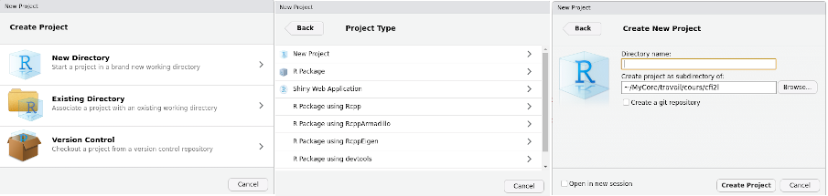
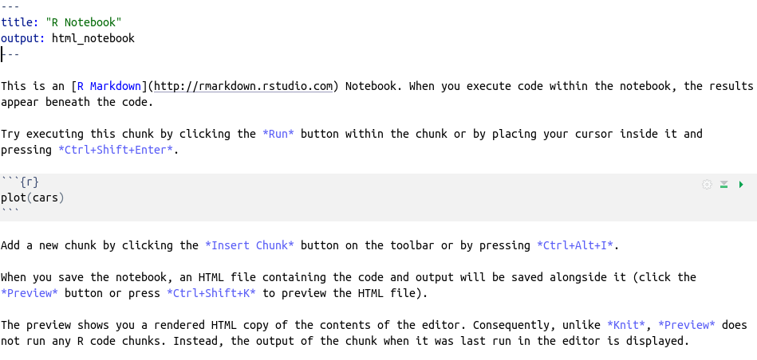
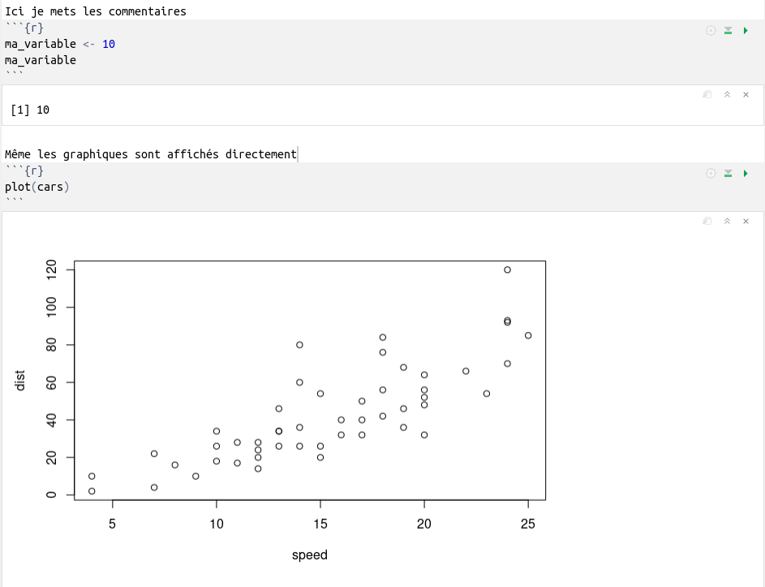
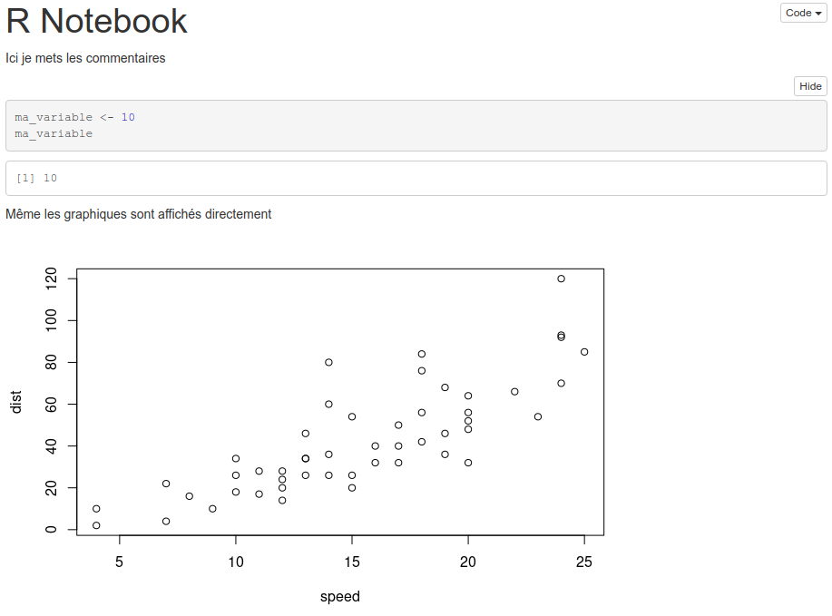
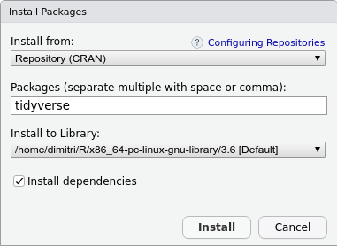
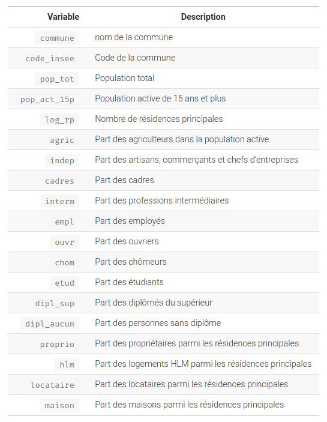
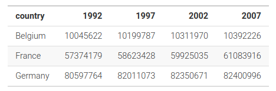
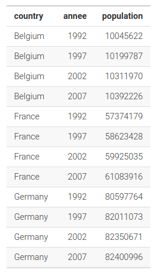

```{r, include=FALSE}
source("script_source.R", local=knitr::knit_global())
```

--- 

**Contenu**

- Introduction
- RStudio
  * interface / console
  * projet / script / notebook
  * packages
- Les bases de R
  * types de données
  * principaux objets / fonctions
  * sélection de données dans un tableau
- Analyse de données 
  * univariée
  * bivariée
- Le tidyverse
  * tibble et chargement d'un fichier
  * recodage des variables
  * mise en forme des données
  * tri et sélection
  * graphiques
  

# Introduction

--- 

- language pour l'analyse de données
- créé en 1996 par R. Ihaka et R. Gentleman
- développement assuré par des statisticiens rassemblés dans la *R Development Core Team*
- publié sous licence GNU GPL  

## Points forts

- multiplateforme
- libre et gratuit
- language interprété
- puissant avec possibilité d'extensions car fonctionne avec un système de packages
- création de graphiques avancés, exportables dans différents formats
- grande communauté d'utilisateurs très actifs

## Points faibles 

- plus un language de programmation qu'un logiciel, même si des efforts sont faits pour développer de plus en plus d'interfaces graphiques "presse-bouton"
- pas simple d'accès au départ, même si des efforts sont faits pour simplifier les commandes et instructions
- language limité aux statistiques

## Installation

- R : https://cran.r-project.org/
- RStudio : https://posit.co/
  
  
# RStudio

---

- Integrated Development Environment (IDE) pour R
- libre, gratuit et multiplateforme

---


---

**3 zones**

- la console (interpréteur R) et le terminal
- les variables d'environnement et l'historique des commandes
- l'aide et la liste des packages

## La console

- permet d'interagir avec l'interpréteur R
- les fléches haut et bas du clavier permettent de naviguer dans l'historique des commandes
- touche entrée du clavier pour exécuter la commande tapée

---

- pour stocker une valeur ou un résultat, il faut créer une variable et lui affecter une valeur
- le signe d'affectation en R est `<-`

```{r}
x <- 10
```

- on affecte la valeur 10 à l'objet (la variable) x
- on appelle x dans la console pour afficher la valeur

```{r}
x
```

- dès que l'on crée une variable elle apparaît dans l'onglet "Environnement"
- les commandes entrées dans la console apparaissent dans l'onglet "History"

---

- on peut créer autant de variables que l'on souhaite et faire des opérations avec
```{r}
x <- 10
y <- 100
x + y
```
- les noms de variable peuvent contenir des lettres, chiffres et les symboles "." et "_"
- ne peuvent pas commencer par un chiffre
- ne pas mettre d'accents
- sensible à la casse (x et X sont deux variables différents)

## Projet

- lorsque l'on commence un projet, on crée un nouveau projet
- permet de signifier à RStudio le dossier dans lequel tous les fichiers du projet seront stockés (sources et sorties)
- évite les chemins complets/absolus, on peut alors utiliser les chemins relatifs
- pour créer un nouveau projet : File/New Project
- soit créer un nouveau dossier sur l'ordinateur
- soit utiliser un dossier existant

File/New Project



## Scripts

- la console c'est pratique mais cela ne conserve pas le code une fois la session fermée
- utilisation de scripts, qui permettent de stocker les commandes, et de les réutiliser
- pour créer un script: File/New File/R Script
- c'est un fichier texte, qu'on enregistre avec l'extension *.R
- pour envoyer le code sélectionné dans la console soit *Run* soit *Ctrl + Entrée*
- "#" pour les commentaires

## Notebooks

- plus convivial que le script
- mélange de Markdown (html simplifié) et de code (avec sa sortie juste en dessous)
- s'exporte en html ou pdf
- facilite le partage et la lecture du document

File/New File/R Notebook



---

- on peut changer title qui est le titre du notebook
- ne pas toucher à output
- ce qui est après les trois tirets peut être supprimé, c'est un texte d'accueil standard
- un notebook est composé de texte au format markdown et de blocs de codes, appelés chunks
- insert/R pour insérer un nouveau chunk ou *Ctrl + alt + i*
- dans le chunk, *Ctrl + Entrée* pour exécuter la ligne courante et *Ctrl + Maj + Entrée* pour exécuter tout le chunk

---

le résultat de l'exécution du chunk est affiché juste en dessous



---

le rendu en html du notebook, créé automatiquement à chaque enregistrement du fichier



## Markdown

- html simplifié
- utilisé pour structurer le Notebook avec des titres, du texte en gras ou italique, des liens, des listes à puces ou numérotées etc.
- RStudio propose un guide rapide : Help/Markdown Quick Reference

## Packages

- système d'extension des possibilités offertes par l'installation de base (R Core)
- ces extensions sont développées et maintenues par la communauté
- elles sont regroupées au sein du réseau CRAN (*Comprehensive R Archive Netwok*)
- pour installer une extension on peut cliquer le bouton *Install* de l'onglet *Packages*
- il faut alors taper le nom du package et cliquer sur *Install*
- ensuite pour pouvoir l'utiliser il faut le charger, avec la commande library(nom_du_package)
- la commande library() est par convention placée dans le premier chunk du notebook (ou en première ligne du script)



---

**Pratique**

- créer un nouveau projet
- créer un nouveau notebook
- installer les packages tidyverse et questionr puis les charger

```
install.packages("tidyverse")
install.packages("questionr")
library(tidyverse)
library(questionr)
```


# Les bases de R

## Les types de données

- numériques : integer (entier) ou double (décimaux). Par défaut les objets numériques sont considérés comme des double, il faut ajouter un L pour que ce soit un integer
- chaînes de caractères : character
- booléens : logical
- NA : donnée manquante (Not Available)
- typeof(objet) pour connaître le type

```{r}
a <- "coucou"
print(typeof(a))
```

## Le vecteur

- pour stocker plusieurs valeurs dans le même objet (tableau unidimensionnel)
- toutes les valeurs du vecteur doivent être du même type 

```{r}
vec_1 <- c(1, 10, 15)
vec_1
```

`c()` est une fonction qui concatène les différentes valeurs dans le même vecteur 

```{r}
(vec_2 <- c("coucou", "hello world"))
```

*Rmq : dans un chunk si on met entre parenthèses la commande ça l'exécute puis affiche la sortie*

---

une opération appliquée à un vecteur s'applique à toutes les valeurs que contient le vecteur

```{r}
tailles <- c(1.75, 1.54, 1.85, 1.92)
(tailles_cm <- tailles * 100)
```

```{r}
poids <- c(72, 59, 110, 95)
(imc <- poids / tailles ^ 2)
```

---

- possible créer des vecteurs vides, en précisant le type: numeric(), character(), logical(). **Si on ajoute un entier en argument cela crée le vecteur avec le nombre d'éléments correspondants**, avec des valeurs par défaut (0 pour numeric, "" pour character et FALSE pour logical)
```{r}
numeric(10)
```

- l'opérateur ":" permet de créer un vecteur d'entiers qui se suivent

```{r}
1:10
```

---

pour accéder à un élément du vecteur, utilisation de l'opérateur \[\] et entre les crochets le numéro de l'élément souhaité (son index dans le vecteur, sachant que la numérotation commence à 1)

```{r}
tailles
```
```{r}
tailles[2]
```

possible de demander plusieurs éléments via un vecteur

```{r}
tailles[2:3]
```

ou

```{r}
tailles[c(1, 3)]
```

---

**Pratique**

A partir des données ci-dessous, calculer le revenu global du foyer puis le revenu par personne.

```{r, eval=F}
conjoint1 <- c(1200, 1180, 1750, 2100)
conjoint2 <- c(1450, 1870, 1690, 0)
nb_personnes <- c(4, 2, 3, 2)
```


## Les fonctions

*- **pour effectuer des calculs ou accomplir des actions**

- une fonction contient un ensemble d'instructions et renvoie un résultat
- on appelle une fonction avec son nom, suivi de parenthèses avec dedans zéro, un ou plusieurs arguments

```{r}
# la fonction mean calcule la moyenne
mean(tailles)
```

```{r}
# la fonction min donne la valeur minimale du vecteur
min(tailles)
```


---

### Autres fonctions utiles

- length(v): renvoie la longueur de v (nombre d'éléments)
- sum(v): renvoie la somme des valeurs de v
- range(v): renvoie un vecteur avec le min et le max
- unique(v): renvoie un vecteur à partir de v mais en ayant supprimé toutes les valeurs en double
- seq(from, to, by): création d'un vecteur de from à to par intervalles de by
- seq(from, to, length.out): création d'un vecteur de from à to de longueur length.out
- rep(vecteur, nombre de fois)

```{r}
# création d'une séquence 
seq(1, 20, by=4)
```

```{r}
# création d'un vecteur par répétition de vecteur
rep(1:3, 2)
```

---
### Aide et arguments

- ?nom_fonction (ou *help("nom_fonction")*) pour afficher l'aide de la fonction
- certaines fonctions ont des arguments obligatoires et des arguments facultatifs
- dans la signature de la fonction les arguments obligatoires n'ont pas de valeur par défaut, les arguments facultatifs en ont un
- par exemple la fonction mean a un argument obligatoire et un argument facultatif *na.rm*, qui permet de ne pas considérer les valeurs manquantes (NA) pour calculer la moyenne

--- 
```{r}
(tailles <- c(tailles, NA))
```
```{r}
mean(tailles)
```
```{r}
mean(tailles, na.rm=TRUE)
```

Attention, comme la fonction *mean* a plusieurs arguments facultatifs, il faut appeler la fonction en utilisant l'argument avec son nom, ici *na.rm*.

--- 

**Pratique**

A partir des deux vecteurs ci-dessous, calculer la témpérature moyenne et le total des précipitations

```{r, eval=F}
temperature <- c(3.4, 4.8, 8.4, 11.4, 15.8, 19.4, 22.2, 21.6, 17.6, 13.4, 7.6, 4.4)
precipitations <- c(47.2, 44.1, 50.4, 74.9, 90.8, 75.6, 63.7, 62, 87.5, 98.6, 81.9, 55.2)
```

---

Avec les vecteurs de notes suivants (6 élèves) :

- faire afficher le min et le max dans chaque matière
- calculer la moyenne générale de chaque élève

```{r, eval=F}
python <- c(12, 16, 8, 18, 6, 10)
html <- c(14, 9, 13, 15, 17, 11)
bdd <- c(18, 11, 14, 10, 8, 12)
```


## Le data frame

- tableau de données bi-dimensionnel (lignes, colonnes)
- chaque colonne est un vecteur de données
- les colonnes peuvent être de type différent

Prenons comme exemple un jeu de données, *hdv2003*, fourni par le package *questionr* chargé précédemment. On charge le jeu de données avec la commande suivante

```{r}
data("hdv2003")
```

cela a pour effet de mettre le jeu de données dans l'environnement de travail (chargé en mémoire dans la session courante de R)  
*hdv2003* est un extrait de l’enquête *Histoire de vie* réalisée par l’INSEE en 2003. Il contient 2000 individus et 20 variables. 

Cliquer sur l'objet dans l'onglet environnement pour voir le tableau de données (on peut aussi appeler la fonction View(hdv2003))

---

### Fonctions utiles

- nouveau nom: df <- hdv2003 - on fait une copie avec comme nom df plutôt que hdv2003 (long à taper)
- nrow(df): renvoie le nombre de lignes
- ncol(df): renvoie le nombre de colonnes
- dim(df): renvoie un vecteur avec les dimensions, cad nrow et ncol
- names(df): renvoie les noms des variables (colonnes)
- str(df): affiche des infos sur le jeu de données - chaque variable avec son type et les premières valeurs (si on clique sur la flèche bleu dans l'environnement cela affiche le contenu de str(df))
- head(df): affiche les premières lignes
- tail(df): affiche les dernières lignes

```{r}
df <- hdv2003
dim(df)
```
```{r}
names(df)
```

---

### Sélection de données

- pour accéder à une variable : objet$colonne
- renvoie le vecteur correspondant

```{r}
head(df$age)
```

- on peut aussi se servir du '$' pour créer une nouvelle variable : dans le dataset il y a la variable heures.tv, on va créer la variable minutes.tv

```{r}
head(df$heures.tv)
df$minutes.tv <- df$heures.tv * 60
head(df$minutes.tv)
```

---

- autrement, l'opérateur \[\], comme pour les vecteurs, fonctionne, si on veut sélectionner des lignes
- dans cet opérateur il y a maintenant 2 dimensions: les lignes et les colonnes
- si on veut les lignes 10 à 12, et pour ces lignes toutes les colonnes

```{r, eval=F}
df[10:12,]
```

```{r, echo=F}
knitr::kable(df[10:12, 1:7], row.names=NA)
```

--- 

si seulement certaines colonnes

```{r, eval=F}
df[10:12, 2:5]
```

```{r, echo=F}
knitr::kable(df[10:12, 2:5])
```

ou par leur nom

```{r, eval=F}
df[10:12, c("age", "sexe", "poids")]
```
```{r, echo=F}
knitr::kable(df[10:12, c("age", "sexe", "poids")])
```

##
### Avec critères
- on sélectionne uniquement certaines lignes en fonction d'un ou plusieurs critères
- ci-dessous on veut uniquement les lignes ou la variable age est égale à 25, et pour ces lignes on veut toutes les colonnes
```{r, eval=F}
df[df$age == 25, ]
```
```{r, echo=F}
knitr::kable(head(df[df$age == 25, 2:7]))
```

##
uniquement les données où age == 25 et sexe == femme
```{r, eval=F}
df[df$age == 25 & df$sexe == "Femme", ]
```
```{r, echo=F}
knitr::kable(head(df[df$age == 25 & df$sexe == "Femme", 2:7]))
```

##
- mêmes critères de ligne que le slide précédent, mais on affiche uniquement certaines colonnes
```{r, eval=F}
df[df$age == 25 & df$sexe == "Femme", c("age", "sexe", "poids")]
```
```{r, echo=F}
knitr::kable(head(df[df$age == 25 & df$sexe == "Femme", c("age", "sexe", "poids")]))
```

## 
### Pratique

A partir du dataset hdv2003

- quel est l'âge moyen ?
- combien y-a-t'il de retraités ?
- combien y-a-t'il de femmes retraitées ?
- quel est l'âge moyen des femmes retraitées ?


# Analyse de données

## Analyse univariée
- c'est l'analyse d'une seule variable
- dépend de son type: 
  + quantitatif (comme l'âge ou le revenu par exemple)
  + qualitatif (nombre limité de valeurs possibles, comme le genre ou la profession par exemple)

##
### Variable quantitative

- on va regarder sa distribution avec des indicateurs simples : minimum, maximum, moyenne, médiane, variance, écart-type
- les fonctions sont min(), max(), range(), mean(), median(), var(), sd()
- on peut aussi calculer les quartiles avec la fonction quantile

```{r}
quantile(df$age)
```
- on peut directement demander un quartile précis avec l'argument prob
```{r}
quantile(df$age, prob=0.25)
```
- la fonction summary() donne toutes ces informations d'un coup
```{r}
summary(df$age)
```

## 
Pour une meilleure visibilité, un graphique s'impose

- pour visualiser la distribution d'une variable quantitative on peut utiliser un histogramme
- fonction hist(vecteur)
```{r, fig.height=5}
hist(df$age)
```

##

- options pour améliorer le graphique : breaks détermine les classes
- on peut passer un nombre (5 par exemple) ou un vecteur (ici [10, 20, 30, ... 100])
- include.lowest pour que la valeur inférieure de la première classe soit incluse
```{r, fig.height=5}
hist(df$age, breaks=seq(10, 100, 10), include.lowest=T)
```

##

- ajout d'un titre, modification du label des axes et changement de couleur des barres
```{r, fig.height=5}
hist(df$age, breaks=seq(10, 100, 10), include.lowest=T, main="Distribution de l'âge", 
     xlab="Classes d'âge", ylab="Nombre d'observations", col="gray")
```

##
Une autre représentation de la distribution d'une variable quantitative est le boxplot (boîte à moustaches), qui reprend les informations des quartiles

- la boîte représente le 1er quartile, la médiane et le 3ème quartile
- donc la boîte représente 50% des observations (il y a 25% des observations en dessous du trait inférieur de la boîte et il y a 25% des observations au dessus du trait supérieur de la boîte)
- les moustaches représentent les valeurs min et max, sachant qu'elles sont au max à 1.5 fois l'inter-quartile. <span style="font-size:0.75em">Si une ou plusieurs valeurs sont en dehors des "moustaches" elles sont représentées par des points. On les considère alors souvent comme des outliers (valeurs extrêmes ou aberrantes)</span>

```{r, fig.height=4}
boxplot(df$age)
```

## 
### Variable qualitative

- la fonction *table()* compte le nombre d'observations de chaque modalité
```{r}
table(df$sexe)
```
```{r}
table(df$qualif)
```

## 
pour comptabiliser les valeurs manquantes il faut ajouter l'argument useNA="always"
```{r}
table(df$qualif, useNA="always")
```
*La fonction summary() appliquée sur une variable qualitative appelle en fait la fonction table()*  

##
Si on veut les pourcentages plutôt que les effectifs, on appelle la fonction *prop.table()* et on lui passe le résultat de l'appelle à la fonction table()
```{r}
prop.table(table(df$qualif, useNA="always")) * 100
```
ou sinon on procède en 2 étapes
```{r}
ma_table <- table(df$qualif, useNA="always")
prop.table(ma_table) * 100
```

##

- si on a chargé la librairie *questionr* alors il y a la fonction *freq()*
- la dernière colonne est en ne comptabilisant que les données "valides", cad sans les NA

```{r}
freq(df$qualif)
```
- freq() à qq paramètres utiles (valid=F pour ne pas afficher la colonne valid, total=T pour afficher une ligne avec le total, et sort="dec" pour afficher du plus grand au plus petit)
```{r}
freq(df$qualif, valid=F, total=T, sort="dec")
```

##
- c'est le graphique en barres (barplot) qui est la représentation graphique de ces effectifs
- la fonction *barplot()* prend en argument un dataframe issu de la fonction *table()* <span style="font-wieght:0.77; font-style: oblique">(las=3 c'est pour changer l'orientation des labels)</span>
```{r fig.height=5}
barplot(table(df$qualif), las=3)
```

##
- parfois il est préférable de trier les effectifs avant de faire le graphique, avec la fonction *sort()*
- cex.axis change la taille de police des labels des ticks (cex pour character expansion ratio)
```{r, fig.height=5}
barplot(sort(table(df$qualif)), cex.names=0.5)
```

## 
Autre façon de représenter les effectifs des différentes modalités, le *diagramme de Cleveland*, avec la fonction *dotchart()*
```{r, warning=F, fig.height=5}
dotchart(sort(table(df$qualif)))
```

## 
### Pratique

- faire une analyse de la variable heures.tv
- faire une analyse de la variable trav.imp
- essayer différents paramètres dans vos graphiques (notamment main, col, xlab, ylab etc.)
- colors() pour afficher la liste de toutes les couleurs de R

## Analyse bivariée

- il s'agit d'étudier la relation entre 2 variables
- l'analyse et les graphiques vont dépendre du type des variables

##
### Deux variables qualitatives

- on fait un tableau croisé, avec la fonction *table()* toujours, mais cette fois en lui passant deux vecteurs
```{r}
(tb_prof_genre <- table(df$qualif, df$sexe))
```

##
- ça a plus de sens en pourcentages, avec la fonction prop.table()
- margin indique l'axe (lignes=1, colonnes=2) par lequel il faut calculer les pourcentages
```{r}
prop.table(tb_prof_genre, margin=1) * 100
```

- la fonction *round()* permet de fixer le nombre de décimales, 2 ci-dessous
```{r}
round(prop.table(tb_prof_genre, margin=1) * 100, 2)
```

##
Changement d'axe pour le calcul: répartition des professions pour chaque genre
```{r}
round(prop.table(table(df$qualif, df$sexe), margin=2) * 100, 2)
```

## 
*questionr* propose 2 fonctions *lprop* et *cprop*, avec en plus le total et un formatage par défaut d'une décimale
```{r}
lprop(tb_prof_genre)
```

qq paramètres utiles: ajout de %, des effectifs, et changement du nombre de décimales
```{r}
lprop(tb_prof_genre, percent=T, n=T, digits=2)
```

##
### Test statistique
- ici on peut faire un test d'indépendance du $\chi^2$ pour savoir si la répartition homme/femme dans chaque métier est proche ou non. 
- plus précisément on pose l'hypothèse $H_0$ que la profession et le genre sont deux variables indépendantes

```{r}
chisq.test(tb_prof_genre)
```

- X-squared est la valeur de la statistique du $\chi^2$ pour le tableau donné, c'est une mesure de distance entre le tableau donné et le tableau théorique si les deux variables étaient indépendantes
- df est le nombre de degrés de liberté
- p-value est la probabilité que l'observe $H_0$. Ici la p-value est inférieure à 5% le seuil standard, donc on rejette $H_0$, i.e. on en déduit que les deux variables ne sont pas indépendantes.

## 
pour aller plus loin on peut regarder les résidus du test, avec la fonction *chisq.residuals()* proposée dans *questionr* <span style="font-weight:0.75em; font-style: oblique">(accessible aussi via chisq.test(table(df\$qualif, df\$sexe))$residuals)</span>
```{r}
chisq.residuals(tb_prof_genre)
```

Interprétation

- si la valeur du résidu pour une case est inférieure à -2, alors il y a une sous-représentation de cette case dans le tableau : les effectifs sont significativement plus faibles que ceux attendus sous l’hypothèse d’indépendance
- si le résidu est supérieur à 2, il y a sur-représentatation de cette case
- si le résidu est compris entre -2 et 2, il n’y a pas d’écart à l’indépendance significatif

## 
### Représentation graphique du tableau croisé
la fonction *mosaicplot()*
```{r, fig.height=5}
mosaicplot(tb_prof_genre, las=3, main="Genre / Profession")
```

##
On ajoute une couleur en fonction de la valeur du résidu.  
Ici en rouge = sous-représentation et en bleu sur-représentation
```{r, fig.height=5}
mosaicplot(tb_prof_genre, shade=T, las=3, main="Genre / Profession")
```

## 
### Pratique
Faire l'analyse de l'importance du travail (variable trav.imp) en fonction du genre

##
### Une variable qualitative et une variable quantitative

- on va chercher à déterminer si les valeurs de la variable quantitative se répartissent différemment ou non selon les modalités de la variable qualitative
- le boxplot permet de voir cela graphiquement: dans l'appel de la fonction on met la variable quantitative puis "~" et ensuite la variable qualitative, donc on représente la dispersion de la variable quantitative en fonction des modalités de la variable qualitative

```{r, fig.height=4}
boxplot(df$age ~ df$sport, ylab="Age", xlab="Pratique d'un sport", col=c("red", "blue"))
```

##
on peut ensuite calculer des indicateurs pour chaque modalité
```{r}
sportifs <- df[df$sport == "Oui",]
cat("Age moyen des sportifs:", mean(sportifs$age))
```
```{r}
non_sportifs <- df[df$sport == "Non",]
cat("Age moyen des non-sportifs:", mean(non_sportifs$age))
```

plus simplement avec la fonction *tapply()*
```{r}
tapply(df$age, df$sport, mean)
```
le premier argument de la fonction est la variable quantitative, le second est la variable qualitative et le troisième la fonction à appliquer. La fonction applique ici "mean()" au vecteur age groupé par modalité.  

##
il est possible de passer une liste de modalites, avec la fonction *list()* qui prend en argument des clés (étiquettes) et des valeurs (objets)
```{r}
tapply(df$age, list(genre=df$sexe, sport=df$sport), mean)
```
les hommes sportifs ont en moyenne 40.73 ans et les sportives 41.13 ans

##
### Test statistique
- on peut tester si l'âge moyen est statistiquement différent selon que l'on soit sportif ou non 
- si la variable quantitative suit un loi normale alors on peut faire un test paramétrique de student, sinon il faut faire un test non-paramétrique de Mann-Whitney
- test de normalité : le test de shapiro - $H_0$ la distribution suit une loi normale
```{r}
shapiro.test(df$age)
```
la p-value est inférieure à 5% donc on rejette $H_0$, il faut utiliser un test non-paramétrique  

## 
sinon, on aurait fait le test de Student ($H_0$: l'âge moyen des deux modalités n'est pas différent)
```{r}
t.test(df$age ~ df$sport)
```

Test de Mann-Whitney : wilcox.test avec argument paired=F car les deux échantillons (sportifs et non-sportifs) ne sont pas les mêmes personnes
```{r}
wilcox.test(df$age ~ df$sport, paired=F)
```

dans les deux tests la p-value est inférieure à 5% donc on rejette $H_0$, autrement dit l'âge moyen des sportifs est significativement inférieur à celui des non-sportifs

## 
### Pratique
Analyser la relation entre le nombre d'heures de télé (heures.tv) et le statut d'occupation (occup)  

*rmq*: dans tapply, après l'appel de la fonction à appliquer il est possible d'ajouter des arguments qui seront transmis à cette fonction à appliquer. Par exemple tapply(x, y, mean, na.rm=T) enverra l'argument na.rm=T à la fonction mean.

## Deux variables quantitatives
chargement d'un nouveau jeu de données, proposé par *questionr*
```{r, eval=F}
data("rp2012")
```
```{r}
df <- rp2012
```
Il s'agit de données sur les communues françaises de plus de 2000 habitants
```{r}
names(df)
```

##


##
- pour étudier la relation entre deux variables quantitatives, il est pratique de représenter les points sur un graphique
- par exemple, la part de cadres dans la commune et la part de diplômés du supérieur dans la commune, donne
```{r, fig.height=4}
plot(df$cadres, df$dipl_sup, ylab="Diplômés du supérieur", xlab="Cadres")
```

On observe une relation linéaire entre les deux variables, c'est à dire que lorsque l'une augmente l'autre augmente également, de façon linéraire (pente à peu près fixe)

##
A l'inverse, si on représente la relation entre la part de cadres et la part de propriétaires, on obtient
```{r, fig.height=5}
plot(df$cadres, df$proprio, xlab="Part de cadres", ylab="Part de propriétaires")
```

La relation est beaucoup moins évidente

## 
### Coefficient de corrélation
Pour déterminer la relation on va calculer le coefficient de corrélation entre les deux variables. Le coefficient de corrélation varie entre -1 et 1, il mesure la force et le sens de la relation entre deux variables. Un coefficient proche de -1 indique une relation négative (lorsque l'une des variables augmente l'autre diminue), et un coefficient proche de 1 indique une relation positive (les deux variables vont dans le même sens).

- si on a une relation linéaire on peut calculer le coefficient de corrélation de Pearson
```{r}
cor(df$cadres, df$dipl_sup, method="pearson")
```
Le coefficient indique qu'il y a une forte relation linéaire positive. 

##
On peut faire le test statistique correspondant avec la fonction *cor.test()*    
$H_0$ : le coefficient est égal à 0
```{r}
cor.test(df$cadres, df$dipl_sup, method="pearson")
```
donc on rejette $H_0$, la corrélation est significativement différente de 0.

##
Si on calcule la corrélation entre la proportion de cadres et la proportion de propriétaires 
```{r}
cor(df$cadres, df$proprio, method="pearson")
```
elle est nettement plus faible

##
Si visuellement on constate que la relation n'est pas linéaire (par exemple une relation non-linéaire monotone), alors il est plus opportun que calculer la corrélation selon la méthode des rangs de Spearman
```{r}
cor(df$cadres, df$dipl_sup, method="spearman")
```

##
### Régression linéaire
Lorsque l'on a une relation linéaire entre deux variables, on peut vouloir estimer la regression linéaire, c'est à dire estimer les paramètres de la droite qui represente au mieux le nuage de points.
```{r}
lm(df$cadres ~ df$dipl_sup)
```
Donc la constante est égale à 0.9217 et la pente de la droite à 1.0816

##
Si la sortie de la fonction lm est placée en argument de la fonction summary alors on a davantage d'informations
```{r}
summary(lm(df$cadres ~ df$dipl_sup))
```

##
pour ajouter cette droite dans le graphique, on utilise la fonction *abline()*
```{r, fig.height=5}
reg <- lm(df$cadres ~ df$dipl_sup)

plot(df$cadres ~ df$dipl_sup, xlab="Cadres", ylab="Diplômés du supérieur")
abline(reg, col="red")
```

##
### Pratique

Analyser la relation entre les variables dipl_aucun (proportion de personnes sans diplômes) et proprio


# Le tidyverse
## Présentation

- ensemble de librairies qui ont pour objectif de faciliter le chargement, le nettoyage, le tri, l'analyse de données et les représentations graphiques
- il faut installer le package "tidyverse", ensuite charger la libraire avec la commande library(tidyverse)


ggplot2 (visualisation), dplyr (manipulation des données), tidyr (mise en forme des données), purrr (programmation), readr (importation de données), tibble (tableaux de données), forcats (variables qualitatives),  stringr (chaînes de caractères)

## Le Tibble

- version moderne du data frame
- les fonctions des librairies du tidyverse acceptent un data frame en entrée, mais retournent un tibble
- par rapport au data frame, le tibble
  + n'a pas de nom de lignes
  + autorise des noms de colonnes avec espaces, caractères spéciaux, nombres etc.
  + a un affichage par défaut sur qq lignes uniquement, avec des informations sur chaque variable
  + affiche un avertissement si on essaie d’accéder à une colonne qui n’existe pas

## 
```{r}
as_tibble(rp2012)
```

un tibble peut également être converti en data frame avec la fonction as.data.frame()

## Lecture / écriture d'un fichier de données

- le csv est le format "standard" pour le stockage et le partage de données 
- c'est un fichier texte avec un séparateur de colonnes (soit le point-virgule soit la virgule, soit une tabulation)
- ce format est compatible avec tous les logiciels et toutes les plateformes
- il y a deux fonctions pour ouvrir un fichier csv:
  + read_csv : pour les fichiers avec une virgule comme séparateur et le point en décimale
  + read_csv2: pour les fichiers avec le point-virgule comme séparateur et la virgule en décimale (comme en France par exemple)
- si besoin d'options spécifiques, alors on passera par read_delim, qui est la fonction générique
- à noter que RStudio propose une interface graphique pour l'import de données, en cliquant sur le bouton "Import Dataset" dans l'onglet Environment

##

- pour écrire dans un fichier csv, il y a les fonction write_csv et write_csv2

- parfois on peut vouloir sauvegarder des objets R dans un fichier, pour une utilisation ultérieure ou pour sauver un dataset à un moment donnée. Cela s'appelle la sérialisation, car le fichier va être enregistré au format de R, et il ne sera lisible que par lui. L'extension du fichier sera alors *.Rdata. 
- il suffit d'appeler la fonction save, avec comme premier argument le ou les objets à sauvegarder, et ensuite file="fichier.Rdata".

- pour charger un fichier Rdata il suffit d'appeler la fonction load("fichier.Rdata")

## Recodage des variables

- souvent quand on récupère un jeu de données il faut le nettoyer, le recoder, créer de nouvelles variables et le mettre en forme pour l'analyse
- c'est l'activité qui prend le plus de temps lorsque l'on découvre un jeu de données

##
### Renommer les modalités d'une variable qualitative

- on va utiliser la fonction fct_recode (qui vient du package forcats, installé automatiquement lorsque l'on installe tidyverse)

- on va pouvoir renommer et/ou regrouper des modalités

```{r}
df <- hdv2003
freq(df$qualif)
```
*Recodage dans le slide suivant*

##
```{r}
df$qualif_grouped <- fct_recode(
  df$qualif,
  "Ouvrier" = "Ouvrier specialise",
  "Ouvrier" = "Ouvrier qualifie",
  "Interm" = "Technicien",
  "Interm" = "Profession intermediaire"
)
freq(df$qualif_grouped)
```

##
Si on souhaite recoder une modalité en variable manquante il faut lui affecter la valeur NULL
```{r}
df$qualif_grouped <- fct_recode(df$qualif_grouped, NULL="Autre")
freq(df$qualif_grouped)
```

et pour coder les NA en une modalité spécifique, il faut utiliser la fonction fct_explicit_na
```{r}
df$qualif_grouped <- fct_explicit_na(df$qualif_grouped, na_level="sans_reponse")
freq(df$qualif_grouped)
```

##
une autre façon pour regrouper les modalités est d'utiliser fct_collapse
```{r}
df$qualif_rec <- fct_collapse(
  df$qualif, 
  "Ouvrier"=c("Ouvrier specialise", "Ouvrier qualifie"), 
  "Interm"=c("Technicien", "Profession intermediaire"))
freq(df$qualif_rec)
```

*Rmq* : 

1. il existe aussi *fct_other()* pour regroupe un ensemble de modalités dans la catégorie "Other", et *fct_lump()* pour regrouper les modalités les moins fréquences dans la catégorie "Other", cf. documentation de ces deux fonctions.
2. il existe une interface graphique, proposée par *questionr*, que l'on peut lancer à partir de *Addins* puis *Levels Recoding*.

##
### Réordonner les modalités d'une variable qualitative

```{r}
df$qualif_rec <- fct_relevel(
    hdv2003$qualif,
    "Cadre", "Profession intermediaire", "Technicien", 
    "Employe", "Ouvrier qualifie", "Ouvrier specialise",
    "Autre"
)

freq(df$qualif_rec)
```

##
Egalement possible de réordonner des modalités par rapport à une fonction appliquée à une autre variable  
Ci-dessous on réordonne les modalités de la variable $occup$ en fonction de l'âge moyen.
```{r, fig.height=5}
df$occup_age <- fct_reorder(df$occup, df$age, mean)
boxplot(df$age ~ df$occup_age, xlab="Occupation", ylab="Age", cex.axis=0.65)
```

## 
### Pratique

- dans les données hdv2003, recoder la variable *relig* afin d'obtenir
```
                              n    % val%
Pratiquant                  708 35.4 35.4
Appartenance                760 38.0 38.0
Ni croyance ni appartenance 399 20.0 20.0
Rejet                        93  4.7  4.7
NSP                          40  2.0  2.0
```

- recoder la variable *nivetud* afin d'obtenir
```
                                          n    % val%
N'a jamais fait d'etudes                 39  2.0  2.1
Études primaires                        427 21.3 22.6
1er cycle                               204 10.2 10.8
2eme cycle                              183  9.2  9.7
Enseignement technique ou professionnel 594 29.7 31.5
Enseignement superieur                  441 22.0 23.4
NA                                      112  5.6   NA
```

- ensuite ré-ordonner les modalités de cette variable afin d'obtenir
```
                                         n    % val%
Enseignement superieur                  441 22.0 23.4
Enseignement technique ou professionnel 594 29.7 31.5
2eme cycle                              183  9.2  9.7
1er cycle                               204 10.2 10.8
Études primaires                        427 21.3 22.6
N'a jamais fait d'etudes                 39  2.0  2.1
NA                                      112  5.6   NA
```

- trier les modalités de la variable *relig* selon l'âge median et faire la représentation graphique avec un boxplot

##
### Créer des modalités en fonction des valeurs d'une variable

- l'idée est de créer une nouvelle variable catégorielle en fonction des valeurs d'une ou plusieurs variables existantes
- pour les cas simples on peut utiliser *if_else*, et pour les cas plus complexes *case_when*
- *if_else* prend 3 arguments, le test, la valeur si vrai et la valeur si faux

```{r}
v <- c(12, 14, 8, 16, 4)
if_else(v > 10, "Supérieur à 10", "Inférieur à 10")
```

- dans le test on peut mettre plusieurs conditions
```{r}
df$statut <- if_else(
    df$sexe == "Homme" & df$age > 60,
    "Homme de plus de 60 ans",
    "Autre"
)

freq(df$statut)
```

##
*case_when* étend *if_else* à plusieurs conditions, sous la forme condition ~ valeur, les tests sont effectués dans l'ordre, donc il faut aller du plus spécifique au plus large.
```{r}
df$statut <- case_when(
    df$age > 60 & df$sexe == "Homme" ~ "Homme de plus de 60 ans",
    df$age > 60 & df$sexe == "Femme" ~ "Femme de plus de 60 ans",
    TRUE ~ "Autre"
)

freq(df$statut)
```

Comme TRUE est toujours vrai toutes les autres combinaisons sont codées "Autre".

##
### Découper une variable numérique en classes

- par exemple transformer une variable qui représente le revenu mensuel en une variable qualitative avec des catégories (moins de 500€, de 500 à 1000€ etc.)
- utilisation de la fonction *cut*
- l'argument *breaks* va permettre de définir les classes

soit le nombre avec breaks=nombre

```{r}
hdv2003$age_classe <- cut(hdv2003$age, breaks=5)
freq(hdv2003$age_classe)
```

## 
soit les bornes avec un vecteur
```{r}
hdv2003$age_classe2 <- cut(
    hdv2003$age, 
    breaks = c(18, 25, 35, 45, 55, 65, 100), 
    include.lowest = T
)
freq(hdv2003$age_classe2)
```

*Rmq*: le package *questionr* a développé une interface graphique pour la fonction *cut*: Addins/Numeric range dividing

##
### Pratique

- avec *if_else*, créer la variable *cinema_bd* qui groupe les personnes qui vont au cinéma et qui lisent des bd. Les autres sont mis dans "Autre". Le résultat attendu est
```
               n    % val%
Autre        1971 98.6 98.6
Cinéma et BD   29  1.5  1.5
```

- avec *case_when* créer la variable *genre_fratrie* ayant les modalités : Homme avec plus de 2 frères et soeurs, Femme avec plus de 2 frères et soeurs, Autre. Le résulat attendu est
```
                                         n    % val%
Autre                                  1001 50.0 50.0
Femme avec plus de 2 frères et soeurs  546  27.3 27.3
Homme avec plus de 2 frères et soeurs  453  22.7 22.7
```

- avec *case_when*, créer une nouvelle variable avec les modalités : Homme de plus de 30 ans, Homme de plus de 40 ans satisfait par son travail, Femme pratiquant le sport ou le bricolage, Autre. Le résultat attendu est
```
                                                   n    % val%
Autre                                             714 35.7 35.7
Femme pratiquant le sport ou le bricolage         549 27.5 27.5
Homme de plus de 30 ans                           610 30.5 30.5
Homme de plus de 40 ans satisfait par son travail 127  6.3  6.3
```

- découper la variable heures.tv en classes afin d'obtenir le tableau de fréquences suivant

```
       n   %    val%
[0,1]  684 34.2 34.3
(1,2]  535 26.8 26.8
(2,4]  594 29.7 29.8
(4,6]  138  6.9  6.9
(6,12]  44  2.2  2.2
NA       5  0.2   NA
```

## Mise en forme des données

pour pouvoir manipuler les données il faut qu'elles soient bien rangées, ie "tidy", notamment:

- chaque variable est dans une colonne unique
- chaque colonne contient une unique variable
- chaque ligne correspond à une observation pour chaque variable
- les cellules du tableau représentent les valeurs de chaque observation pour chaque variable
  


##
exemple de données non tidy : Population de 3 pays sur 4 années



pour que ce soit tidy il faudrait 

- une observation par ligne (ici 4)
- une variable année et une variable population

##
Le dataset serait alors



##
Fonction *pivot_longer* pour créer un dataset "plus long" c'est à dire avec plus de lignes
```{r, echo=F}
tidy_ex <- data.frame(country=c("Belgium", "France", "Germany"), `2002`=c(10311970, 59925035, 82350671), `2007`=c(10392226, 61083916, 82400996))
colnames(tidy_ex)[2:3] <- c("2002", "2007")
print(tidy_ex)
```

les colonnes 2002 et 2007 devraient être dans une seule colonne "année" et les valeurs dans une colonne "population"

```{r}
pivot_longer(data=tidy_ex, cols=c("2002", "2007"), names_to="annee", values_to="population")
```

##
Fonction *pivot_wider* pour à l'inverse créer un dataset "plus large", c'est à dire avec plus de colonnes

```{r, echo=F}
tidy_ex1 <- data.frame(country=c(rep("Belgium", 4), rep("France", 4)), continent=rep("Europe", 8), year=rep(c(rep(2002, 2), rep(2007, 2)), 2), 
                                 variable=rep(c("lifeExp", "pop"), 4), 
                                 value=c(78.320, 10311970.000, 79.441, 10392226.000, 79.590, 59925035.000, 80.657, 61083916.000))
tidy_ex1
```

la colonne variable devrait être divisée en deux variables lifeExp et pop

```{r}
pivot_wider(data=tidy_ex1, names_from=variable, values_from=value)
```

##
Fonction *separate* pour séparer une colonne en plusieurs
```{r, echo=F}
(tidy_ex2 <- data.frame(eleve=c("Christophe Martin", "Jacques Dupont", "Stéphane Nimporte"), note=c("10/20", "12/20", "8/20")))
```

Séparation de élève en prenom et nom
```{r}
(tidy_ex2 <- separate(tidy_ex2, col=eleve, into=c("prenom", "nom"), sep=" "))
```

##
Séparation de note en note et note_sur
```{r}
(tidy_ex2 <- separate(tidy_ex2, col="note", into=c("note", "note_sur"), sep="/"))
```

##
Fonction *separate_rows* pour séparer une colonne en plusieurs lignes
```{r, echo=F}
tidy_ex3 <- tidy_ex2[c("prenom", "nom")]
tidy_ex3$classe <- c("6ème", "5ème", "4ème")
tidy_ex3$notes <- c("5,16,11", "15", "11,17")
tidy_ex3
```

```{r}
(tidy_ex3 <- separate_rows(tidy_ex3, notes, sep=","))
```

##
Fonction *unite* pour faire l'inverse de *separate*
```{r}
tidy_ex3_bis <- tidy_ex3
unite(tidy_ex3_bis, col=eleve, prenom, nom, sep=" ")
```

##
Fonction *complete* pour compléter les combinaisons manquantes

```{r, echo=F}
tidy_ex4 <- tidy_ex3[c("prenom", "nom")]
tidy_ex4$matiere <- c("Python", "R", "HTML", "HTML", "R", "Python")
tidy_ex4$note <- tidy_ex3$notes
tidy_ex4
```

Jacques n'a pas de note en R et Python, et Stéphane n'a pas de note en HTML

```{r}
(tidy_ex4 <- complete(tidy_ex4, nesting(prenom, nom), matiere))
```

l'argument *nesting* permet de signifier que prenom et nom identifient une même personne, sinon il y aurait toutes les combinaisons de prenom et nom en plus dans le dataset

## Manipuler les données

le package dplyr propose 5 verbes qui facilitent la manipulation des données (tri, sélection etc.) : slice, filter, select, arrange et mutate

Pour les exemples, utilisation des datasets du package nycflights13 (données des vols de départ de 3 aéroports de New-York en 2013)  
il faut installer le package "nycflights13" et le charger
```{r, eval=F}
data("flights")
data("airports")
data("airlines")
```

##
### slice

Permet de sélectionner des lignes du dataset par leur index

```{r}
slice(airports, 2:8)
```

##
### filter

Permet de sélectionner des lignes du dataset en fonction de critères  
Fonctionne avec du boolean indexing, c'est à dire renvoie les lignes pour lesquelles là (ou les) conditions sont vraies  

Exemple: tous les vols du mois de janvier
```{r}
filter(flights, month==1)
```

##
Plusieurs conditions  

Exemple: tous les vols qui ont entre 10 et 15 minutes de retard au décollage
```{r}
filter(flights, dep_delay >= 10 & dep_delay <= 15)
```

##
Possible de passer le résultat d'une fonction dans la condition  

Exemple: les vols avec la distance la plus longue
```{r}
filter(flights, distance == max(distance))
```

##
### select

Permet de sélectionner les colonnes du dataset  

Exemple: sélectionner des colonnes latitude et longitude
```{r}
select(airports, lat, lon)
```

##
Si on fait précéder le nom de la colonne d'un "-" cela affiche toutes les colonnes sauf elle

```{r}
select(airports, -lat)
```

##
La fonction select peut prendre comme argument des éléments permettant une sélection selon des critères
```{r}
select(flights, starts_with("dep_"))
```

il y a aussi *ends_with*, *contains* et *matches*

##
Pour renommer les colonnes il y a la fonction *rename*

```{r}
rename(airports, longitude=lon, latitude=lat, altitude=alt)
```

nouveau nom = ancien nom  
si le nouveau nom (ou l'ancien) comporte un ou des espace(s) il faut mettre entre guillemets

##
### arrange

Pour ordonner le dataset selon les valeurs d'une ou plusieurs colonnes

```{r}
arrange(flights, dep_delay)
```

##
Utilisation de la fonction *desc()* pour inverser l'ordre (décroissant)
```{r}
arrange(flights, desc(dep_delay))
```

##
Plusieurs critères
```{r}
arrange(flights, month, (dep_delay))
```

##
### mutate
Pour créer de nouvelles colonnes à partir de colonnes existantes

```{r}
head(select(flights, air_time), 5)
```

Création d'une colonne air_time_hours 
```{r}
flights <- mutate(flights, air_time_hours = air_time / 60)
head(select(flights, air_time, air_time_hours), 5)
```

##
Possible de créer plusieurs nouvelles colonnes d'un coup
```{r}
flights <- mutate(
    flights,
    distance_km = distance / 0.62137,
    vitesse = distance_km / air_time_hours
)
select(flights, air_time_hours, distance_km, vitesse)
```

## Le *pipe*

Les actions vues précédemment peuvent être enchaînées grâce au *pipe* c'est à dire l'envoi du résultat de l'action précédente comme premier argument de l'action suivante. C'est l'opérateur %>% qui joue ce rôle

```{r}
flights %>%
  filter(dep_delay >= 10 & dep_delay <= 15) %>%
  arrange(desc(dep_delay)) %>%
  select(flight, origin, dest, dep_delay, air_time_hours, distance_km, vitesse) %>%
  head(5)
```

Attention ici les actions s'enchaînent (pipeline) mais rien n'est conservé. Si on veut placer le résultat dans un objet il faut commencer par objet <- 

```{r}
delays <- flights %>%
  filter(dep_delay >= 10 & dep_delay <= 15) %>%
  arrange(desc(dep_delay)) %>%
  select(flight, origin, dest, dep_delay, air_time_hours, distance_km, vitesse)
```

Cette fois le résultat du pipeline sera stocké dans l'objet delays

##
### Pratique

- afficher les lignes 100 à 105 du dataset flights
- afficher les vols du mois de juillet 2013
- afficher les vols qui ont eu un retard (variable arr_delay) compris entre 5 et 15. Le résultat doit être affiché par ordre décroissant
- selectionner les colonnes name, lat et lon du dataset airports et renommer lat et lon en latitude et longitude
- dans le dataset airports, créer une nouvelle variable alt_metres qui contient l'altitude en mètres (conversion de pieds en mètres en divisant la variable alt par 3.28)

##
### Grouper les données avec group_by

- permet de grouper les données puis d'appliquer une fonction à ces données groupées
- exemple: grouper les données par mois et affiche le premier index (combinaison group_by et slice)

```{r}
flights %>% group_by(month) %>% slice(1)
```

##
Grouper les données par compagnie, calculer le delay moyen et le mettre dans une varaible mean_delay (combinaison group_by et mutate)
```{r}
flights %>%
  group_by(carrier) %>%
  mutate(mean_delay = mean(dep_delay, na.rm=T)) %>%
  select(carrier, origin, dest, mean_delay)
```

##
Grouper les données par mois, et afficher les vols qui ont le délai maximum (combinaison group_by et filter)
```{r}
flights %>%
  group_by(month) %>%
  filter(dep_delay == max(dep_delay, na.rm=T)) %>%
  select(carrier, month, origin, dest, dep_delay) %>%
  arrange(month)
```

##
### Appliquer une fonction aux données: summarise

```{r}
flights %>%
  summarise(
    retard_depart=mean(dep_delay, na.rm=T),
    retard_arrivee=mean(arr_delay, na.rm=T)
  )
```

##
Utilisée avec group_by, summarise permet d'agréger une information sur des données groupées  

On affiche le retard moyen de chaque compagnie et ordonne le résultat du plus grand retard moyen au plus petit
```{r}
flights %>%
  group_by(carrier) %>%
  summarise(retard_depart=mean(dep_delay, na.rm=T)) %>%
  arrange(desc(retard_depart))
```

##
Si on veut connaître le nombre de lignes concernées, on passe l'argument n=n() dans l'appel de la fonction summarise
```{r}
flights %>%
  group_by(carrier) %>%
  summarise(
    retard_depart=mean(dep_delay, na.rm=T),
    n=n()
  )%>%
  arrange(desc(retard_depart))
```

##
Possible de grouper les données selon plusieurs variables  
On groupe les données par mois et par destination et on compte le nombre de vols

```{r}
flights %>% 
  group_by(month, dest) %>%
  summarise(n=n()) %>%
  arrange(desc(n))
```

##
On peut utiliser les variables générées par summarise pour créer une nouvelle variable
```{r}
flights %>% 
  group_by(month, dest) %>%
  summarise(n=n()) %>%
  mutate(pourcentage=n/sum(n) * 100) %>%
  arrange(desc(pourcentage))
```

##
### Pratique

- afficher le nombre de vols par mois et afficher le résultat par ordre croissant du nombre de vols
- calculer le nombre de vols à destination de Los Angeles (code LAX) pour chaque mois de l'année
- calculer le nombre de vols par mois et par destination et afficher uniquement le max
- calculer le nombre de vols par mois et créer une colonne qui affiche le pourcentage que cela représente sur les vols annuels

## Graphiques avec ggplot2

dataset pour travailler
```{r}
rp <- rp2012 %>% filter(departement %in% c("Oise", "Rhône", "Hauts-de-Seine", "Lozère", "Bouches-du-Rhône"))
head(rp)
```

##
### Histogramme

- d'abord initialiser la fonction graphique en lui passant le dataset utilisé: ggplot(data=rp)
- ensuite on ajoute les graphiques (geom) avec un "+", ici geom_histogram
- dans le geom on ajoute les arguments demandés, notamment dans la fonction aes()


```{r, fig.height=4}
ggplot(data=rp) +
  geom_histogram(aes(x=cadres))
```

##
### Nuage de points
il faut passer 2 arguments à la fonction aes (aesthetic), la variable x et la variable y
```{r, fig.height=5}
ggplot(data=rp) +
  geom_point(aes(x=dipl_sup, y=cadres))
```

##
Pour personnaliser le graphique on peut passer d'autres arguments à geom_point en plus de la fonction aes

```{r, fig.height=5}
ggplot(data=rp) +
  geom_point(aes(x=dipl_sup, y=cadres), col="blue", size=2)
```

##
### Boxplot

```{r, fig.height=5}
ggplot(data=rp) +
  geom_boxplot(aes(x=departement, y=maison))
```

##
L'argument varwidth permet que la largeur de la box soit proportionnelle au nombre d'observations

```{r, fig.height=5}
ggplot(data=rp) +
  geom_boxplot(aes(x=departement, y=maison), varwidth=T)
```

##
### Graphique en barres

```{r, fig.height=5}
ggplot(data=rp) +
  geom_bar(aes(x=departement))
```

##
Si on veut ajouter un "y" que l'on a calculé soit même alors il faut ajouter l'argument stat="identity" dans l'appel de la fonction geom_bar  
Exemple: on calcule le pourcentage que représente le nombre de communes de chaque département par rapport au total, en utilisant les connaissances acquises

```{r, fig.height=4}
rp %>% group_by(departement) %>% summarise(n=n()) %>% mutate(pourcent=n/sum(n) * 100) %>%
  ggplot() + geom_bar(aes(x=departement, y=pourcent), stat="identity")
```

##
### Courbes d'évolution dans le temps
chargement d'un jeu de données du package ggplot2 : economics
```{r, eval=F}
data("economics")
economics
```

##
```{r, fig.height=5}
chom <- economics %>% select(date, unemploy)
ggplot(chom) + 
  geom_line(aes(x=date, y=unemploy))
```

si on souhaite plusieurs courbes on fait plusieurs appels à geom_line (avec "+" entre chaque)

##
### Principe du mappage

- Associer un des attributs du graphique (couleur, taille) à une variable
- Permet de rendre visuelle une troisième dimension (voire une quatrième)
- Le mappage se fait dans l'appel de la fonction *aes()*

```{r, fig.height=4}
ggplot(rp) +
  geom_point(aes(x = dipl_sup, y = cadres, color = departement))
```

##
on ajoute une 4ème dimension à travers la taille des points, qui représente la population totale de la commune
```{r, fig.height=4}
ggplot(rp) +
  geom_point(aes(x=dipl_sup, y=cadres, color=departement, size=pop_tot))
```

##
Possible de paramétrer un mappage avec scale_
```{r, fig.height=4}
ggplot(rp) +
  geom_point(aes(x=dipl_sup, y=cadres, color=departement, size=pop_tot)) +
  scale_size("Population", breaks=c(0, 5000, 10000, 50000, 100000), range=c(0, 10))
```

##
### Ajouter une droite de régression dans un nuage de points avec geom_smooth

Si on ajoute plusieurs geom qui utilisent les mêmes arguments dans la fonction aes, on peut passer la fonction aes() dans l'appel de la fonction ggplot

```{r, fig.height=4}
ggplot(rp, aes(x=dipl_sup, y=cadres)) +
  geom_point() + geom_smooth(method ="lm", color="red")
```

##
### Principe du faceting

- répéter un graphique plusieurs fois selon une ou plusieurs variables 

```{r, fig.height=4}
ggplot(rp) +
  geom_histogram(aes(x=cadres)) +
  facet_wrap(vars(departement))
```

##
### Personnalisation des axes

scale_x_continuous et scale_y_continuous pour les axes x et y de données quantitatives

```{r, fig.height=4}
ggplot(data=rp) +
  geom_point(aes(x=dipl_sup, y=cadres)) +
  scale_x_continuous("Diplômes supérieurs", limits=c(0, 60)) +
  scale_y_continuous("Cadres", limits=c(0, 60))
```

##

scale_x_discrete et scale_y_discrete pour les variables qualitatives

```{r, fig.height=4}
ggplot(rp) +
  geom_bar(aes(x = departement)) +
  scale_x_discrete("Département")
```

*Rmq*: il existe un package, esquisse, qui propose ensuite un Addins pour faire les graphiques avec une interface graphique: install.packages("esquisse"), puis library(esquisse) et ensuite Addins/ggplot2 builder

##
### Pratique

Avec le dataset rp2012

- un nuage de points x=dipl_aucun et y=ouvr, avec titre des axes, et points en bleu
- même graphique que précédemment mais avec un mappage de couleur selon la région
- boxplot: distribution de la variable proprio par rapport à la taille de departement (pop_cl)
- nuage de points avec en x=dipl_sup et y=cadres avec un graphique par région (facet_wrap)
- boxplot: distribution du pourcentage moyen de propriétaires par département au sein de chaque région


# Sources
##
- un ouvrage complet sur l'analyse de données avec R [ici](https://larmarange.github.io/analyse-R/analyse-R.pdf)
- le cours de Julien Barnier accessible en ligne [ici](https://juba.github.io/tidyverse/index.html)
- le site https://www.tidyverse.org/
- le site [R for data science](https://r4ds.had.co.nz/index.html)
- le site de ggplot2 http://ggplot2.tidyverse.org/reference/
- des exemples de graphiques avec ggplot2 : http://www.cookbook-r.com/Graphs/
